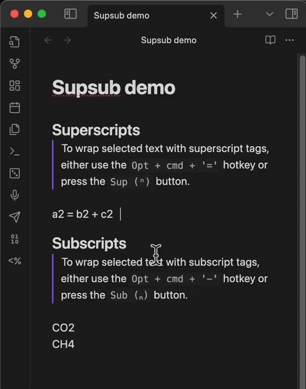

# SupSub

  

**SupSub** is an Obsidian plugin that allows you to easily format selected text with `` and `` tags, enabling quick superscript and subscript formatting in your notes.

## Usage

- **Superscript**:
  - **Hotkey**: `Option + Command + '='` on macOS or `Ctrl + Alt + '='` on Windows.
  - **With selection**: Wraps the selected text with `` tags.
  - **Without selection**: Activates superscript typing mode — a status bar indicator ("SUP") appears and everything you type is formatted as superscript. Press **Escape** to exit.
  - **Button**: **Sup (ⁿ)**

- **Subscript**:
  - **Hotkey**: `Option + Command + '-'` on macOS or `Ctrl + Alt + '-'` on Windows.
  - **With selection**: Wraps the selected text with `` tags.
  - **Without selection**: Activates subscript typing mode — a status bar indicator ("SUB") appears and everything you type is formatted as subscript. Press **Escape** to exit.
  - **Button**: **Sub (ₙ)**

- **Remove Formatting**:
  - **Action**: Removes existing `` or `` tags from the selected text.
  - **Button**: **Normal (n)**
  - **With hidden tags**: When the "Hide Tags" setting is enabled, simply select the visible superscripted/subscripted text and hold the modifier key — the "Normal (n)" button appears automatically, even if your selection doesn't perfectly match the raw tag boundaries.

- **Toggling**:
  - If the selected text is already wrapped in `` or ``, using the respective button or hotkey will remove the tags.
  - The plugin uses position-aware detection: as long as your cursor or selection overlaps any part of a tag, it will correctly unwrap instead of double-wrapping.

- **Popup Modifier Key**:
  - By default, the popup buttons only appear when holding **Cmd** (macOS) or **Ctrl** (Windows/Linux) while selecting text.
  - Change the modifier key in **Settings > SupSub > Popup Modifier Key**.
  - Set to **None** to restore the previous always-show behavior.

## Example Workflow

1. **Add Superscript/Subscript**:
   - Select the text you want to format.
   - Click the **Sup (ⁿ)** or **Sub (ₙ)** button in the popup, or use the designated hotkeys.
   - The selected text will be wrapped with the corresponding tags, and the popup will disappear.

2. **Remove Superscript/Subscript**:
   - Select the text that is already formatted with `` or `` tags.
   - Click the **Normal (n)** button in the popup.
   - The tags will be removed, the text will be reverted to normal formatting, and the popup will disappear.

3. **Remove Formatting with Hidden Tags**:
   - With **Hide Tags** enabled, tags are invisible — you only see the styled content.
   - Select the visible superscripted/subscripted text and hold the modifier key (Cmd/Ctrl).
   - The popup shows **Normal (n)** — click it to remove the tags.
   - No need to select the exact raw tag boundaries; any overlapping selection works.

## Contributing

Contributions are welcome! If you encounter any issues or have suggestions for improvements, please open a new issue or submit a pull request in the [GitHub repository](https://github.com/wjgoarxiv/obsidian-supsub).

## License

This plugin is licensed under the [MIT License](https://github.com/wjgoarxiv/obsidian-supsub/blob/master/LICENSE).

---

## Changelog

### Version 1.1.1 (@2026-02-18)

- **Bug Fixes**:
  - **Fixed Decoration Ordering Crash**: Replaced `RangeSetBuilder` with `Decoration.set(ranges, true)` to eliminate "Ranges must be added sorted" console errors on edge cases.
  - **Fixed Cursor Placement After Wrapping**: After wrapping text with sup/sub, the cursor now correctly lands inside the tags (before the closing tag) instead of at the end of the line. Uses `requestAnimationFrame` to ensure stable positioning after decoration reflow.
  - **Fixed Normal Button Not Appearing**: When tags are hidden by decorations, selecting superscripted/subscripted content now reliably shows the "Normal (n)" button. Uses overlap detection instead of strict containment, so imprecise selections still work.
  - **Fixed Double-Wrapping**: Selecting text that partially overlaps existing tags no longer produces malformed output like `2`. The plugin detects overlapping tags and unwraps instead of double-wrapping.

- **Improvements**:
  - **Position-Aware Unwrapping**: The unwrap logic now scans the raw line for tags at the cursor position rather than relying on exact selection text. This handles all cases where hidden decorations cause visual-to-raw coordinate mismatches.
  - **Cursor Line Tag Visibility**: Tags are now shown on the line where the cursor is (matching Obsidian's native behavior for bold/italic), allowing direct editing when needed.

### Version 1.1.0 (@2026-02-17)

- **Bug Fixes**:
  - **Fixed Tag Hiding Rendering**: Switched from `Decoration.mark()` with `display: none` to `Decoration.replace()` for hiding ``/`` tags. This eliminates cursor position mismatches that caused letters to disappear when typing near formatted text.
  - **Fixed Text Shifting**: Removed `display: inline-block` and `position: relative` CSS properties from superscript/subscript elements that were causing text to shift positions during editing.
  - **Fixed Hide Tags Toggle**: The "Hide Tags" setting now properly toggles on and off without requiring a restart.
  - **Performance Optimization**: Decoration computation now only processes visible ranges instead of the entire document.

- **New Features**:
  - **Modifier Key for Popup**: The popup buttons now require holding a modifier key (Cmd/Ctrl by default) while selecting text. This prevents accidental popup appearances during normal text navigation. Configurable in Settings with options: Cmd/Ctrl, Ctrl, Shift, Alt, or None (legacy behavior).
  - **Toggle Typing Mode**: Activate superscript or subscript mode without selecting text first. Place your cursor and press the hotkey — a status bar indicator appears and everything you type is automatically formatted. Press Escape to exit. Supports toggling between modes and auto-exits on line change.

### Version 1.0.5 (@2025-05-19)

- **Bug Fixes**:
  - **Fixed Text Shifting Issue**: Resolved an issue where superscript and subscript text would shift positions when editing text in rows above.
  - **Fixed Disappearing Text**: Fixed a problem where letters would disappear when typing near superscript or subscript content.
  - **Improved Decoration Handling**: Enhanced the way hidden tags are managed to ensure consistent editing experience.

### Version 1.0.4 (@2024-12-03)

- **Bug Fixes**:
  - **Resolved Selection Error**: Fixed an issue where enabling the popup buttons and using the **Sup** or **Sub** buttons could cause a `TypeError` related to invalid selection points. The plugin now correctly validates selection ranges to prevent errors.

- **Improved Stability**:
  - Enhanced compatibility with the latest Obsidian updates by refining editor integrations and ensuring seamless functionality.

### Version 1.0.3 (@2024-12-01)

- **Enhanced Button Labels**: Updated the popup buttons to be more user-friendly:
  - **Sup (ⁿ)**: Wraps the selected text with `` tags.
  - **Sub (ₙ)**: Wraps the selected text with `` tags.
  - **Normal (n)**: Removes existing `` or `` tags from the selected text.
- **Conditional Button Display**:
  - When the selected text is already wrapped in `` or ``, only the **Normal (n)** button is displayed to allow easy removal of the tags.
  - When the selected text is not wrapped, both **Sup (ⁿ)** and **Sub (ₙ)** buttons are available for formatting.
