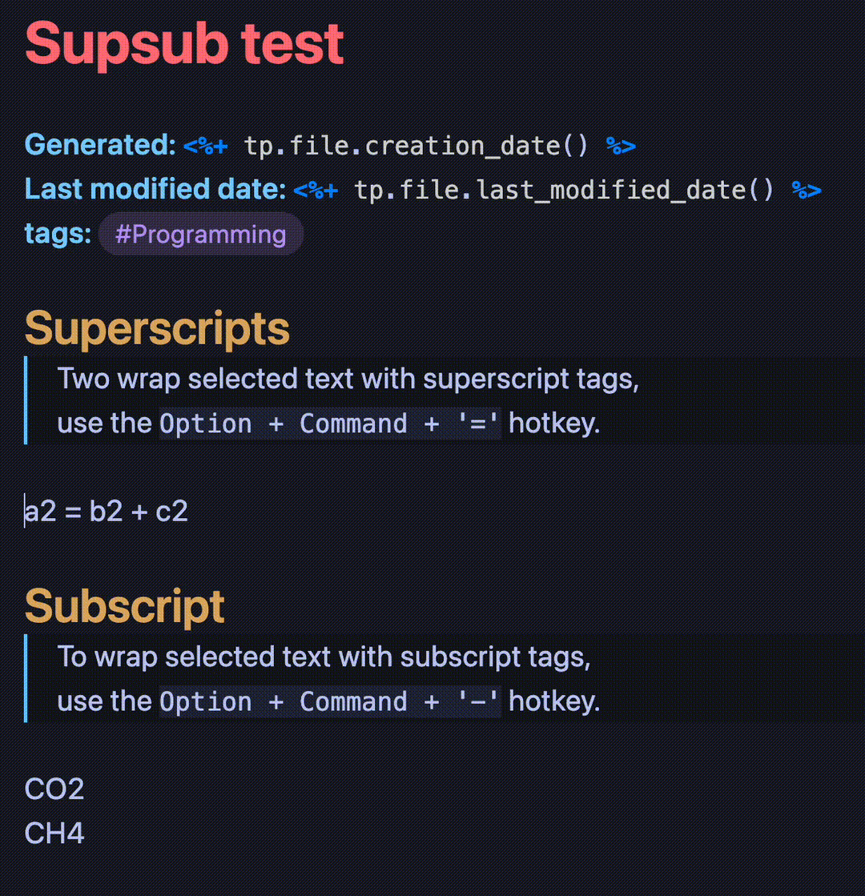

# SupSub

The **SupSub Plugin** provides a convenient way to wrap selected text with `` and `` tags, allowing you to easily format __superscripts__ and __subscripts__ in your notes.

## Installation

1. Clone or download the repository files to your local machine.
2. Copy the `main.js` and `manifest.json` files to your Obsidian vault's plugins directory.
3. Enable the plugin in the Obsidian settings under "Community Plugins".

Please note that this installation method requires manual copying of the plugin files to your Obsidian vault. Once the release files are available, you will be able to download them directly from the Releases page and follow the standard installation procedure. I am actively working on getting the Obsidian SupSub Plugin approved for inclusion in the Obsidian Community Plugins gallery. Once it is approved, you will be able to conveniently install the plugin directly from the Obsidian settings under "Community Plugins". I appreciate your patience and understanding during this process.

## Usage

- To wrap selected text with superscript tags, use the `Option + Command + '='` hotkey.
- To wrap selected text with subscript tags, use the `Option + Command + '-'` hotkey.
- If the selected text is already wrapped with the tags, using the hotkey will de-bracket the text.

## Contributing

Contributions are welcome! If you encounter any issues or have suggestions for improvements, please create a new issue or submit a pull request.

## License

This plugin is licensed under the [MIT License](LICENSE).
